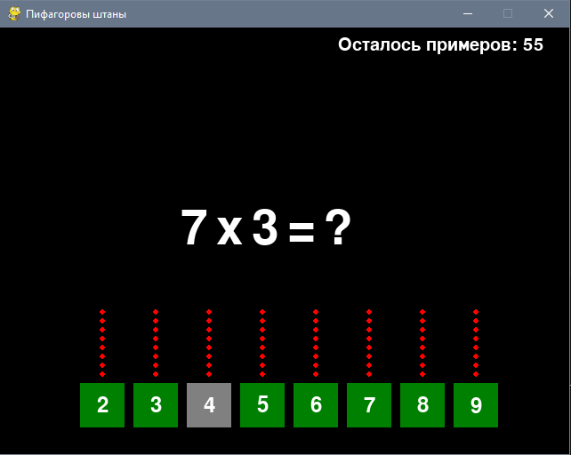

# **Пифагоровы штаны**

Программа для повторения таблицы умножения.
Результаты тестирования отправляются в телеграмм чат.

## Как играть:
 - В начале игры выбираются цифры не участвующие в тесте.
 Их можно выбрать мышкой. После выбора не участвующие цифры будут выделены
 серым цветом.
 - После нажатия на кнопку СТАРТ! игра начинается.
 - Ответы вводятся цифрами с клавиатуры.
 - Вопросы идут в разнобой. Правильные ответы подсвечиваются зелёным кружком 
 над цифрой.
 - Общее оставшееся количестов примеров выведено в правом верхнем углу.
 - При неправильном ответе вопрос повторяется для усвоения.
 - Отчет о результатах направляетсяв чат телеграмма с подробной метрикой.

## Для запуска:
 - Установи зависимости из requirements.txt
 - Создай файл password.txt. В него нужно ввести первой строкой TOKEN бота в
 телеграмм, полученный от BotFather при его создании.
 Второй/третьей строкой ввести номер чата в который будет отправлена метрика.
 - Запусти файл pifagor.py

## Язык:
Python

## Автор:
_Торчин Антон_
_torchinae@yandex.ru_
